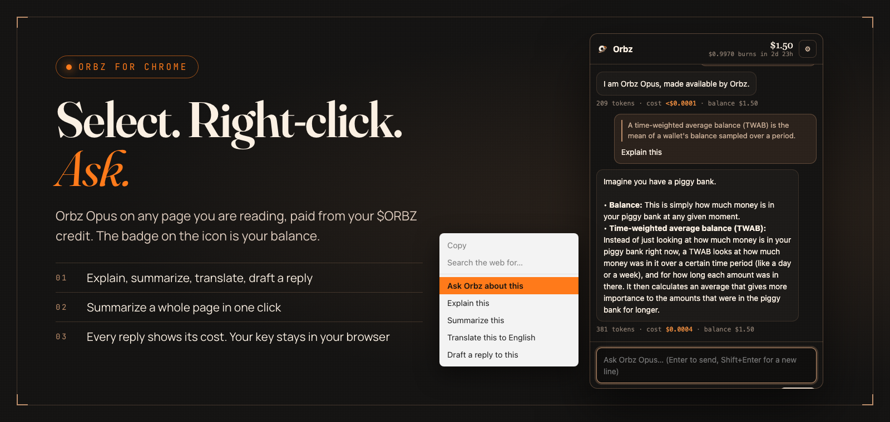
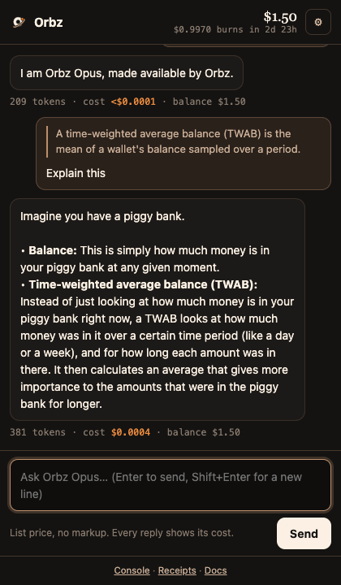
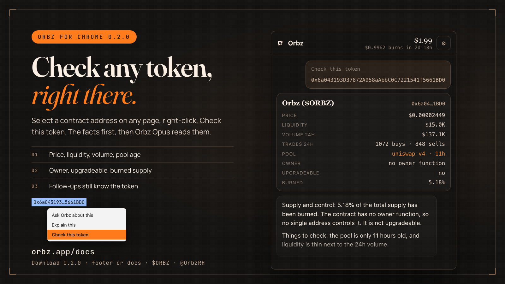
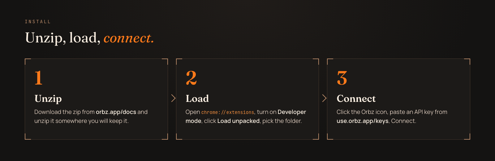

<div align="center">



<br/>

[](releases/)
[](manifest.json)
[](#install)

**[Download the zip](releases/orbz-extension-0.2.0.zip)** · [Get a key](https://use.orbz.app/keys) · [Docs](https://orbz.app/docs#chrome) · [orbz.app](https://orbz.app) · [X @OrbzRH](https://x.com/OrbzRH)

</div>

---

## What it does

**Orbz for Chrome** puts Orbz Opus one right-click away, paid from the $ORBZ credit that lands in your wallet every
30 minutes.

| | How |
|---|---|
| **Ask about a selection** | Select text on any page, right-click: **Ask Orbz about this**, **Explain this**, **Summarize this**, **Translate this to English**, **Draft a reply to this** |
| **Summarize a page** | Right-click anywhere: **Summarize this page** |
| **Check a token** | Select a contract address, right-click: **Check this token**, or paste one into the panel. A fact card (price, liquidity, volume, pool age, owner, upgradeable, burned) from the chain and DEX Screener, then Orbz Opus's read. Follow-ups still know the token. The card is free, the read is paid like any reply |
| **Chat** | Click the Orbz icon in the toolbar and the side panel opens |
| **Meter** | The badge on the icon is your balance. The panel header shows which credit burns next, and when |

Every reply shows its token count, its cost and your balance after it. Replies are billed at list price, oldest
credit first, exactly like a call to the API.

<p align="center"></p>

<p align="center"></p>

## Install

<p align="center"></p>

1. **Download** [`orbz-extension-0.2.0.zip`](releases/orbz-extension-0.2.0.zip) (also on [orbz.app/docs](https://orbz.app/docs#chrome)) and unzip it somewhere you will keep it.
2. **Load.** Open `chrome://extensions`, turn on **Developer mode** (top right), click **Load unpacked**, pick the folder.
3. **Connect.** Click the Orbz icon, paste an API key from [use.orbz.app/keys](https://use.orbz.app/keys), **Connect**.

Chrome 116 or newer, and browsers built on it that support side panels. A Web Store listing follows; until then the
extension installs unpacked, as above.

## Privacy

- Your key is kept in the extension's own storage, which web pages cannot read. **Disconnect** removes it. To kill the
  key everywhere, revoke it on the Keys page.
- A page is read only when you ask (**Summarize this page**). Only that page's text, your selection, or what you type
  is sent, and only to `api.orbz.app`.
- No analytics, no account, no server of its own. This repository is the whole extension.

## Permissions, and why

| Permission | Used for |
|---|---|
| `storage` | Your key and settings |
| `contextMenus` | The right-click entries |
| `sidePanel` | The chat panel |
| `activeTab`, `scripting` | Reading the page you right-clicked, only then |
| `alarms` | Refreshing the badge every 10 minutes |
| host `api.orbz.app` | The only place it talks to |

## Files

| File | |
|---|---|
| `manifest.json` | Manifest V3 |
| `background.js` | The right-click menu, opening the panel, the badge |
| `sidepanel.html`, `sidepanel.css`, `sidepanel.js` | The panel: connect, chat, settings. Answers are rendered from DOM nodes, never HTML |
| `shared.js` | Settings, the API calls, money formatting |
| `pack.sh` | Builds the release zip |
| `releases/` | Release zips |

## Build from source

Nothing to build: load this folder unpacked. To make a release zip:

```bash
./pack.sh
```

## Links

| | |
|---|---|
| Get a key | [use.orbz.app/keys](https://use.orbz.app/keys) |
| Docs | [orbz.app/docs](https://orbz.app/docs#chrome) |
| Model and prices | [use.orbz.app/models](https://use.orbz.app/models) |
| $ORBZ | `0x6a043193D37872A958aAbbC0C7221541f5661BD0` on Robinhood Chain |
| X | [@OrbzRH](https://x.com/OrbzRH) |

---

<div align="center">
<sub>
Orbz credits are a grant of product access to AI model usage. They are not transferable, not redeemable for cash or any
digital asset, and not an investment return. Credit amounts depend on trading activity and are never fixed or promised.
</sub>
</div>
